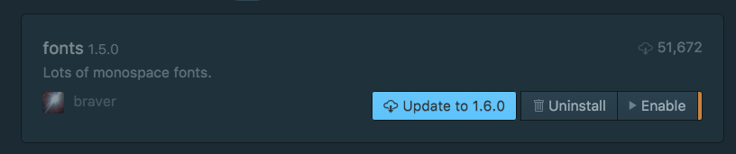
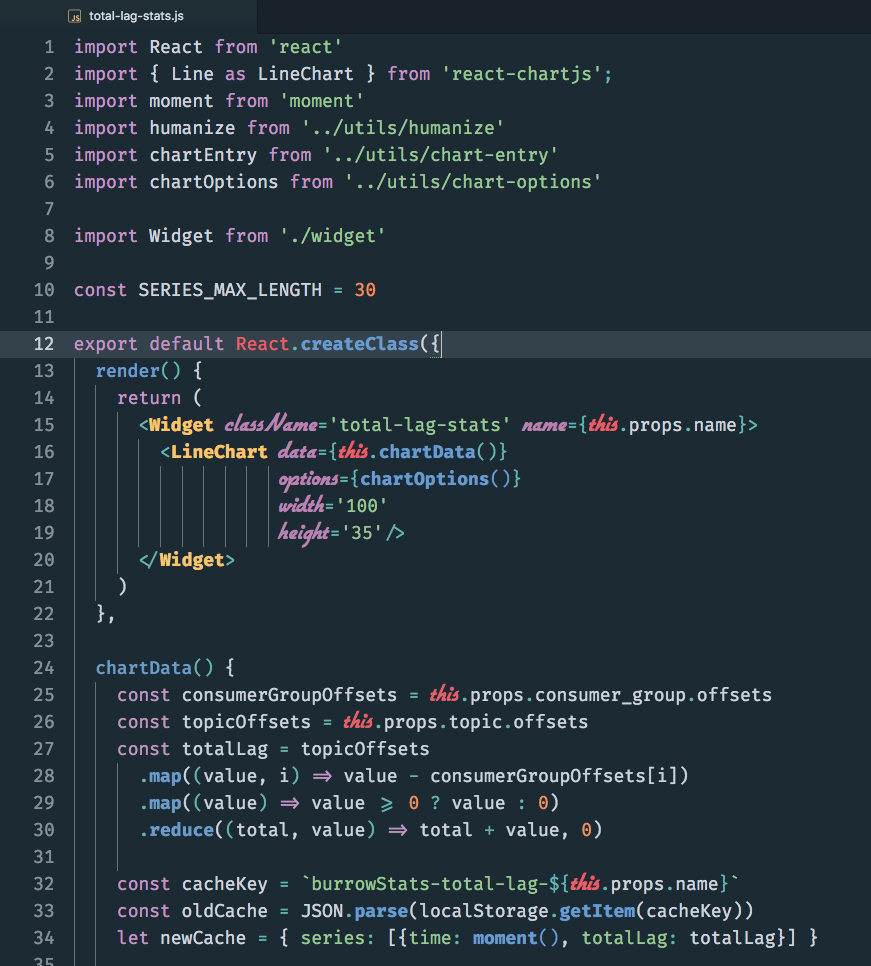
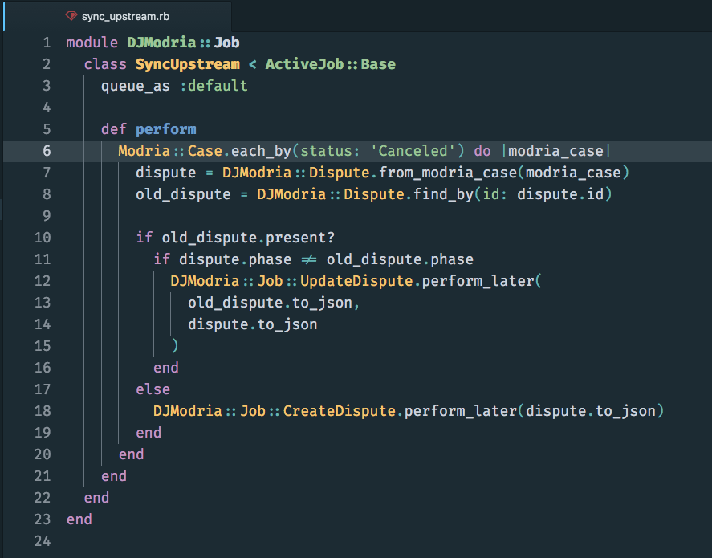
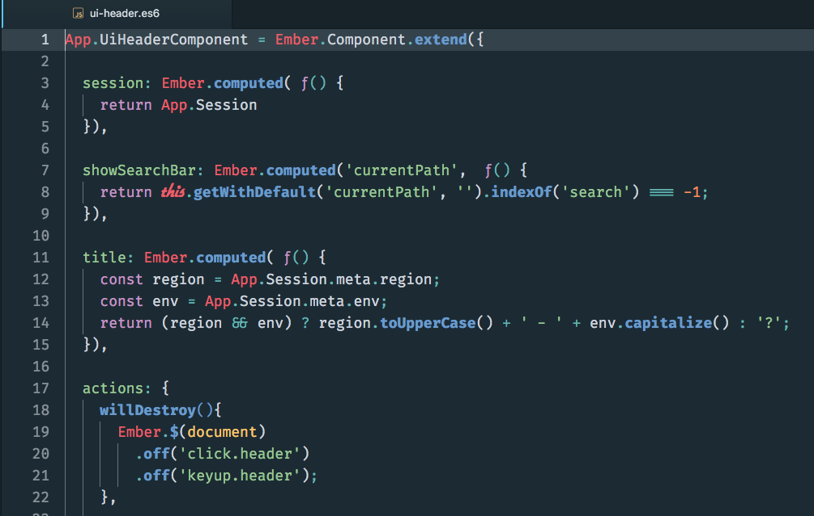
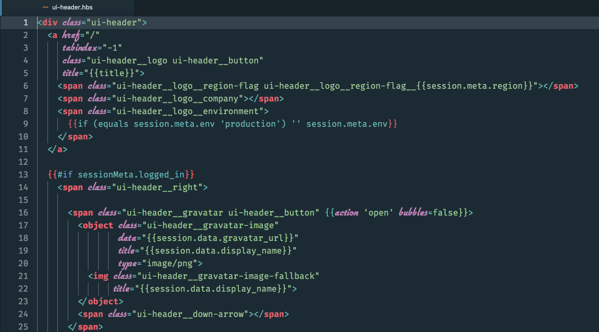
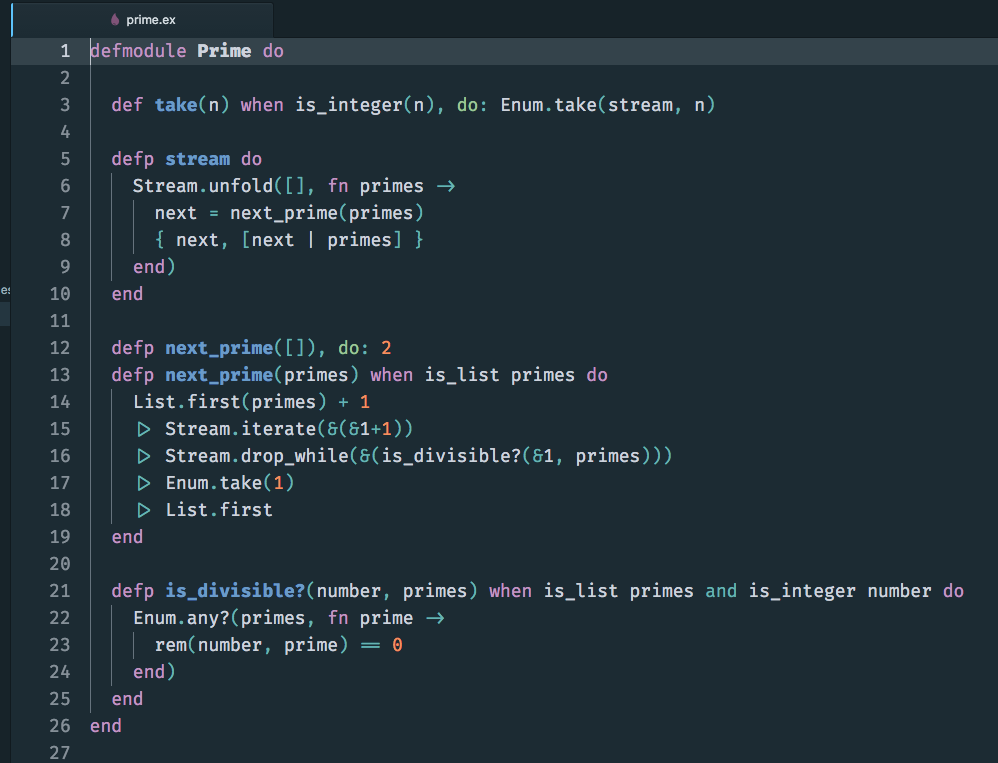
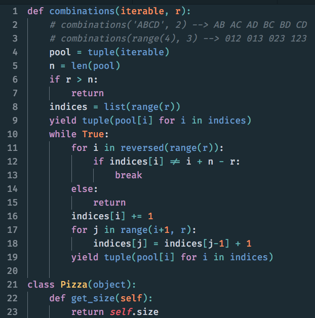

# operator-mono-atom
Free [Operator Mono](http://www.typography.com/blog/introducing-operator) clone for Atom

A stylish way to code! Optimized for React, Ember and Ruby development.

Check out the [screenshots](#screenshots).

## Installation

1. [Install fonts](#install-fonts)
2. [Configure Atom](#configure-atom)
3. [Troubleshooting](#troubleshooting)
4. [Screenshots](#screenshots)
  1. [JSX](#screenshot-jsx) 
  2. [Ruby](#screenshot-ruby) 
  3. [Ember](#screenshot-ember) 
  4. [Handlebars](#screenshot-handlebars) 
  5. [Elixir](#screenshot-elixir) 
  6. [Python](#screenshot-python) 
    
### <a name="install-fonts"></a> Install fonts

Download and install [Fira Code](https://github.com/tonsky/FiraCode) font into your system. [Installation instructions](https://github.com/tonsky/FiraCode/wiki)

Download and install [flottflott](http://www.dafont.com/flottflott.font) font into your system in the same manner.

The current version (September 2016) of the fonts can also be found in this repository.

### <a name="configure-atom"></a> Configure Atom

Once fonts are installed, bring up Atom and open up your stylesheet. Replace the contents with the one in this repository (don't forget to back up your old if you want it back).

The stylesheet has some custom overrides to complement a certain syntax theme. If you do not want to use this syntax theme please update `styles.less` to remove the custom overrides. The code comment should be enough to figure out which are needed...

#### Syntax Theme

Install and use this Syntax Theme: [Oceanic Next Italic](https://atom.io/themes/oceanic-next-italic)

NOTE: There are deprecation issues in 1.13 and beyond which is not fixed in the base branch of Oceanic Next Italic, until they fix that a workaround is to use my fork:

```
cd ~/.atom/packages
rm -rf oceanic-next-italic-atom/
git clone git@github.com:klippx/oceanic-next-italic-atom.git --depth=1
```

#### UI Theme

Every syntax theme is more or less aesthetically coupled with the UI theme. I recommend using this UI theme [One Dark](https://atom.io/themes/one-dark-ui) (by Atom): https://atom.io/themes/one-dark-ui

### <a name="troubleshooting"></a> Troubleshooting

Are your ligatures not being applied correctly?

1. In Editor Settings, you might need to enter "Fira Code" in "Font Family"
2. In Editor Settings, be advised to have "Use Shadow DOM" turned on!
3. Disable interfering packages that modifies fonts, such as "fonts"



### <a name="screenshots"></a> Screenshots

#### <a name="screenshot-jsx"></a> JSX



#### <a name="screenshot-ruby"></a> Ruby



#### <a name="screenshot-ember"></a> Ember



#### <a name="screenshot-handlebars"></a> Handlebars



#### <a name="screenshot-elixir"></a> Elixir



#### <a name="screenshot-python"></a> Python


